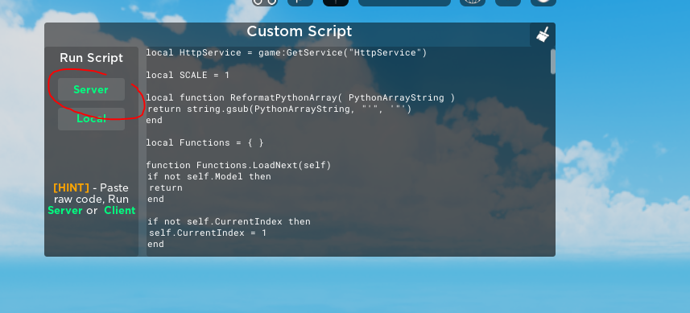

# Roblox Pixel Renderer

## Instructions

1. Get the path to the image

2. Edit the "FILEPATH = ..." line with the image filepath


3. Run the PixelLoader python script

4. Get result out2.txt and upload to pastebin with the following format:
	
	```lua
	local Data = [[DATA_HERE]]
	_G.V111 = "["..Data.."]"
	```
	

5. Run the pastebin code with "h/PASTEBIN_RAW_URL"
	

6. in the BillboardPixels.lua / PartPixels.lua, edit the following lines.
	```lua
	local ImageWidth = 240
	local ImageHeight = 135
	```
	

7. Run  the BillboardPixels.lua / PartPixels.lua in script builder.
	